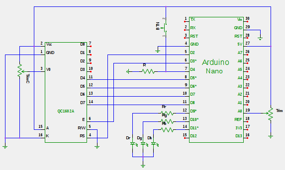

# Arduino Nano RGB
Controlla il colore di un led RGB tramite un trimmer ed un bottone.
Un display mostra correntemente lo stato del sistema.

## Schema Di Montaggio

Nome | Valore
-----|-------
R    |  10 kΩ
Rr   | 330 Ω
Rg   | 330 Ω
Rb   | 330 Ω
Trim | 100 kΩ
TrimC| 5 kΩ
BTN  | n.o.
Dr   | Rosso
Dg   | Verde
Db   | Blu

## Regolare Il Colore
1. Entrare in **edit-mode** tenendo premito il bottone per almeno 1 secondo.
   Il display mostrerà il nome del colore che si modificherà per primo.
2. Selezionare il colore da regolare con pressioni consecutive del bottone. Il
   colore selezionato lampeggia per 3 volte.
3. Regolare il colore intervenendo sul trimmer. Il valore viene mostrato sul
   display.
4. Uscire dalla **edit-mode** tenendo premuto il bottone per almeno 1 secondo.

Il funzionamento della macchina è descritto nel diagramma seguente:

## I File
- **rgb.ino**: codice sorgente Arduino.
- **rgb.dot**: definizione del grafo di funzionamento in linguaggio `dot`.
- **showDocu**: script `bash` che genera la documentazione e la apre nel web browser di default.
- **README.md**: questo file.
- **doxyfile**: file di configurazione `doxygen` per generare la documentazione.
- **arduino_rgb.sch**: sorgente gEDA dello schema circuitale.